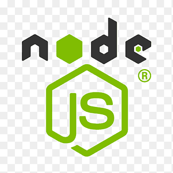
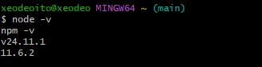
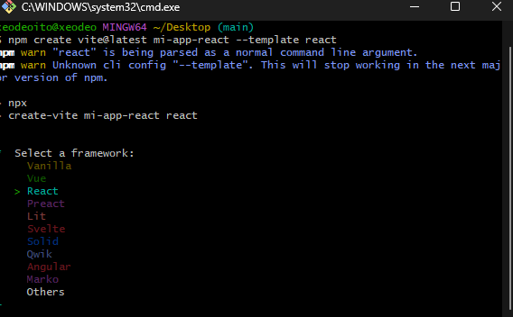
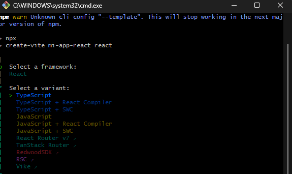
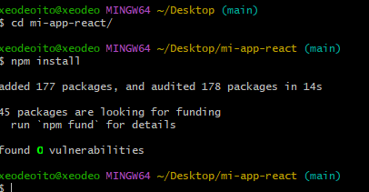

# 🚀 Guía de Instalación de Node.js y React

Bienvenido a esta guía completa para instalar **Node.js**, configurar el entorno y crear tu primer proyecto en **React**.  
Perfecta para principiantes, estudiantes y desarrolladores que quieran empezar rápido.

---

## 📑 Tabla de Contenidos
1. [¿Qué es Node.js?](#-qué-es-nodejs)
2. [Instalar Node.js](#-instalar-nodejs)
3. [Verificar instalación](#-verificar-instalación)
4. [Crear proyecto React con Vite](#-crear-proyecto-react-con-vite)
5. [Iniciar proyecto React](#-iniciar-proyecto-react)
6. [Estructura del proyecto](#-estructura-del-proyecto)
7. [Extensiones para VSCode](#-extensiones-recomendadas-para-vscode)
8. [Errores comunes y soluciones](#-errores-comunes-y-soluciones)
9. [Autor](#-autor)

---

# 🟦 ¿Qué es Node.js?

Node.js es un entorno de ejecución de JavaScript basado en el motor V8 de Google Chrome que permite:

- Ejecutar JavaScript fuera del navegador  
- Crear servidores  
- Manejar dependencias con NPM  
- Desarrollar aplicaciones modernas (React, Vite, Next.js)



---

# 🟩 Instalar Node.js

### 🔹 1. Descargar Node
Ir a la página oficial:

👉 https://nodejs.org/

Descargar la versión **LTS (recomendada)**.


---

### 🔹 2. Ejecutar instalador
1. Abrir archivo descargado  
2. Aceptar términos  
3. Mantener configuración por defecto  
4. Finalizar la instalación


---

# 🟨 Verificar instalación

Ejecutar en la terminal:

```bash
node -v
npm -v
```

Obtendrás algo como:

```
v20.xx.xx
10.xx.xx
```

Si ves versiones → Node quedó instalado correctamente 🎉



---

# 🟧 Crear proyecto React con Vite

⭐ **Método recomendado** (más rápido y moderno que Create React App)

### 🔹 1. Crear el proyecto

Ejecuta el siguiente comando en la terminal:

```bash
npm create vite@latest mi-app-react --template react
```

Durante el proceso interactivo, el instalador de Vite te hará varias preguntas en la terminal. Debes seleccionar las siguientes opciones:

1. **Nombre del proyecto:**  
   Escribe el nombre de tu proyecto (por ejemplo, `mi-app-react`) y presiona Enter.

2. **Framework:**  
   Elige la opción `React` usando las teclas de flecha y presiona Enter.

   

3. **Variante:**  
   Elige `TypeScript` (recomendado) usando las teclas de flecha, luego presiona Enter.

   

Esto generará la estructura básica de un proyecto React con Vite y TypeScript.


---

### 🔹 2. Instalar dependencias

Accede a la carpeta del nuevo proyecto e instala las dependencias:

```bash
cd mi-app-react
npm install
```


---