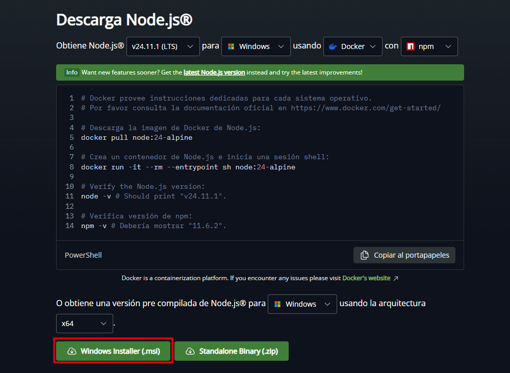
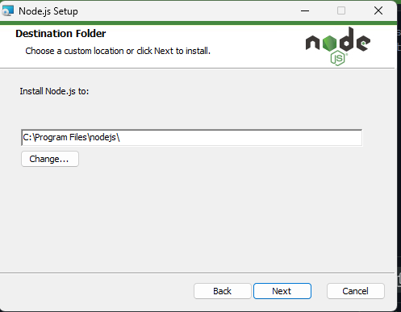

# 🚀 Guía de Instalación de Node.js y React  
Bienvenido a esta guía completa para instalar **Node.js**, configurar el entorno y crear tu primer proyecto en **React**.  
Todo explicado paso a paso, con imágenes y comandos listos para copiar.

---

## 📦 1. Instalación de Node.js

### 🔹 Paso 1: Descargar Node.js
Descarga la versión LTS desde la página oficial:

👉 https://nodejs.org/



---

### 🔹 Paso 2: Ejecutar el instalador
Sigue estos pasos:

1. Doble clic en el instalador  
2. Aceptar términos  
3. Mantener opciones por defecto  
4. Finalizar instalación



---

### 🔹 Paso 3: Verificar instalación

Ejecuta en tu terminal:

```bash
node -v
npm -v
